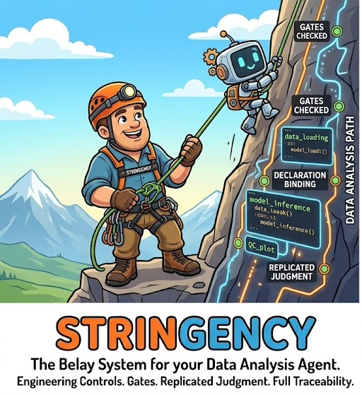

# stringency

<p align="center">
  
</p>

## What this is

Ever been rock climbing? Stringency is the belay system for an agent doing your data analysis.

The agent is the climber. It writes the code, runs the steps, reads the outputs, and proposes what
to do next. That part it is good at, and a scientist who knows their own data and can ask a sharp,
verifiable question is well placed to direct one. Often better placed than a handoff to someone who
has never seen the sample.

What agents are bad at is falling safely. A model that hits a roadblock reaches for the next
plausible approach, and then the one after that, without flagging that it has left the conventional
path. A model that asserts something false about your data will happily build on it for hours. When
the session ends the reasoning ends with it, and the spreadsheet left on your desk has no answer to
"how did you get this?" or "why this way?"

So the route goes up before the climb, and the rope stays on:

**The route is bolted in advance.** The pipeline topology, the modules, their parameters and
thresholds, the prompts, the gate implementations and the controlled vocabularies all live in a git
repository, pinned to a tag, committed before anything runs. The agent routes within that topology.
It does not invent an analysis plan when it meets new data. A dirty working tree is not a valid run.

**You check the knots before anyone leaves the ground.** `init` binds a project to one pipeline,
one objective, one design and one set of hashed inputs, then echoes back its own reading of those
declarations. Nothing runs until the owner accepts the echo-back. If the engine has misread what
your experiment is, you find out then rather than four hours in.

**The belay device is passive.** Gates are pure functions over a declared state: no I/O, no clock,
no randomness. The agent's reasoning is not one of their inputs, so they cannot be talked around. A
gate fires or it does not, and one that fires with `block` stops the step. It does not warn and
continue, and the message it prints never suggests a way around itself.

**Judgment is replicated, not trusted once.** Where a call genuinely needs a model, such as
labelling a cluster or reading a QC plot, it is made several times independently, the replicates are
compared, and disagreement or low confidence becomes a hold rather than a majority vote. Abstaining
is always an allowed answer. Arithmetic is never a judgment call: anything that can be code is code,
and a model that proposes a statistical test has its assumptions checked against the data before
that test is allowed to run.

**Someone is on the other end of the rope.** A hold names a person and waits. Their verdict, the
hashes it was made against, the timestamp and the reason all go into the record beside the model's
output, with the same rigor applied to the human call as to the model's.

**Every move is logged.** The trace is an append-only SQLite database, enforced at the trigger
level: every action proposed, every gate verdict and the evidence it inspected, every model
invocation with its cost, every human review, every output with its hash. The trace is the product;
the code exists to fill it correctly.

### What it does not do

A belay does not make anyone a better climber. It makes falling survivable, and it makes the falls
visible.

stringency will not make an analysis correct, and it is not a substitute for knowing what you are
doing. It holds an agent to a path you declared, stops it where a person should be looking, and
leaves a record complete enough to answer "how did you do this?" and "why this way?" months later.
The science is still yours.

## Design

The engine is domain-free. Domain knowledge (state extractors, predicates, vocabularies) lives in
plugins registered under the `stringency.plugins` entry point group. `plugins/stringency-toy` is the
reference plugin and the one the test suite uses; `stringency-singlecell` (separate repository) is
the plugin for application 1.

The spec is `spec/stringency-design.md`; `spec/README.md` maps the rest of that directory. The
motivation, and the twelve constraints the design answers to, is `spec/commandments.md`. Choices
made where the design is silent are in `spec/DECISIONS.md`; contract deviations, if any, in
`spec/DEVIATIONS.md`. Current plans are in `spec/plans/`, starting with `roadmap-2026-09.md`.

## Status

Early. Phase A is complete: milestones M0 through M11 with their acceptance tests, plus exit runs on
two lab workstations, the second as two chained projects driven from agent-drafted declarations,
tagged `v0.1.0`. The backlog those runs produced is closed (`spec/archive/improvements.md`); open
items are in `spec/plans/backlog.md`. `integrations/claude-science/` holds the operator and declare
skills, the brief renderer, host notes, and two worked examples.

The API is not stable and the only published plugin is the toy one.

## Quickstart

```
uv sync --all-groups
uv run pytest
uv run stringency --help
uv run stringency plugins list
```

A project is bound with `init`, its echo-back accepted with `review`, and then driven by `run`:

```
stringency init <dir> --method <git-url>@<tag> --pipeline <name> \
    --objective objective.yml --design design.yml --inputs inputs.yml \
    [--profile standard] [--judgment-harness subagent] [--executor apptainer]
cd <dir>
stringency review --verdict accept --hold <id> --reason "..."   # the owner accepts the echo-back
stringency run          # exit 21: a ticket; run its `exec` line, then its `submit` line
stringency run          # exit 20: judgment requests written; subagents answer, then run again
stringency run          # exit 10: a hold; `stringency review` shows it
stringency deliver      # on a completed run: finals, coverage.md, methods.md, index.json
```

`run` is the loop: each call either advances the pipeline or stops and tells you why. Exit codes are
in design 14.2. Every verb takes `--json`.

## Claude Science setup

A Claude Science session drives a project as its operator: it calls the CLI, runs the steps the
engine hands it, and answers judgment dispatches with fresh delegates. The session's sandbox
cannot start containers, so the engine runs on the workstation that holds the data and the
container runtime, and the session reaches it as an SSH compute provider. The full checklist is
`integrations/claude-science/new-project.md`; in outline:

1. On the workstation, once: `scripts/install.sh --prefix <shared dir>` puts a versioned engine
   under `<shared dir>/current/bin` (on PROTSEQ, `/data/lab/env/stringency`; see
   `integrations/claude-science/hosts/protseq-lab.md`). Container images live where the method
   manifest says.
2. In Claude Science, once per instance: add the workstation as an SSH compute provider, set the
   project area as a data root, publish the `stringency-operator` skill
   (`integrations/claude-science/stringency-operator/SKILL.md`).
3. Per project: render the agent context and the session brief from the project with
   `integrations/claude-science/render_brief.py`, paste the context into the project's Agent
   Context, paste the brief as the first message, and accept the confirm hold at your terminal
   when the agent reports it. Every later hold comes back to you the same way.

`integrations/claude-science/examples/toy-cs/` holds a completed run: the texts as used, the
agent's reports for each phase, and the delivered coverage report and methods paragraph.

## Layout

```
src/stringency/         the engine (no biology imports; CI checks)
plugins/stringency-toy/ reference plugin, its method repo, fixtures
templates/method-repo/  what a new method repository starts from
integrations/           Claude Science: skill, brief renderer, setup checklist, example run
docs/                   README assets
spec/                   design, build plan, contracts, decisions
notes/                  session notes; read INDEX.md first
tests/                  one file per milestone area; mock harness and local executor only
```
